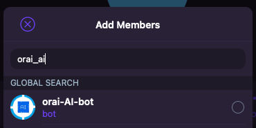
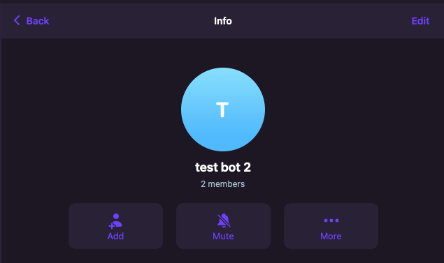
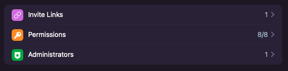
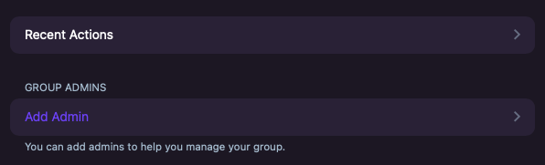
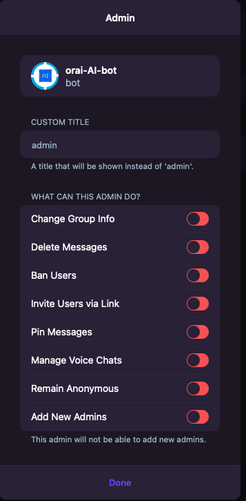

# Orai ai bot - on Telegram

Link: https://t.me/orai_AI_bot

# Description

To our surprise, we are glad to introduce "Orai AI bot", a helpful AI bot that will accompany with us during the AMA. This bot's functionality is to lend us a hand in filtering out unique questions, get rid of [duplicated] ones and so forth. Hope we all get on well with "Orai AI bot".

# How to use

## Step 1: Add bot to your group as admin

Click "+Add"

Search "orai_ai_bot" and add to your group

Click "edit"

Click "administrators"

Click "add admin"

Change premission then click "Done"

## Step 2: check group id

Go to your group and chat

    /check_group_id

Orai_ai_bot will return an id of your group.

You need remember your group id to start the AMA.

## Step 3: Using

### Start AMA

    Command: /start_ama your_group_id ama_name

    Example: /start_ama 123456 orai_with_airight

### Stop AMA

    Command: /stop_ama your_group_id ama_name

    Example: /stop_ama 123456 orai_with_airight

### Get unique question

If you want get unique only from current AMA

    Command: /get_question your_group_id ama_name

    Example: /get_question 123456 orai_with_airight

If you want get unique from all AMA

    Command: /get_question_all_db your_group_id ama_name

    Example: /get_question_all_db 123456 orai_with_airight
